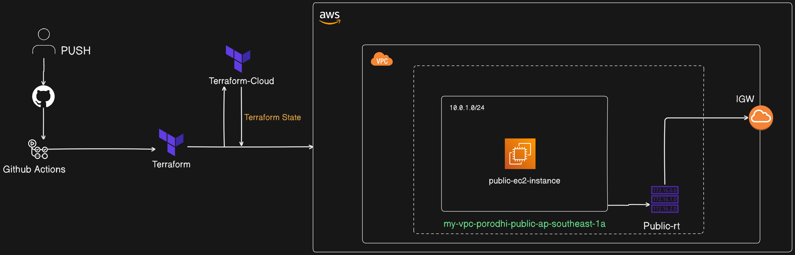

##Github action AWS infra with Terraform:

Automating AWS VPC Deployment with EC2 using GitHub Actions and Terraform Cloud
In this lab, you will learn how to automate the deployment of an AWS infrastructure using Terraform and GitHub Actions. The infrastructure includes a Virtual Private Cloud (VPC) with a public subnet, an Internet Gateway (IGW), and an EC2 instance. The SSH public key used to access the EC2 instance will be securely managed using GitHub Secrets, and the Terraform state file will be stored in Terraform Cloud to ensure consistency and security across deployments.

##Objectives:

By the end of this lab, you will be able to:

Automate the deployment of an AWS VPC with a public subnet using Terraform and GitHub Actions.
Securely manage and store an SSH public key using GitHub Secrets.
Deploy an EC2 instance within the public subnet.
Store and manage the Terraform state file in Terraform Cloud.
Output key information such as the EC2 instance’s public IP, VPC ID, Subnet ID, and Security Group ID.

##Prerequisites:

Before starting this lab, ensure you have the following:

-GitHub Account: A GitHub account to store your project and manage secrets.
-Terraform Cloud Account: A Terraform Cloud account to manage the Terraform state file.
-AWS Account: An AWS account with permissions to create and manage VPCs, EC2 instances, and related resources.
-SSH Key Pair: An SSH key pair (id_rsa and id_rsa.pub) generated on your local machine.

##Scenario:

You're tasked with automating the deployment of an AWS VPC with a public subnet and an EC2 instance using Terraform. The infrastructure will be defined in Terraform, with the state file stored in Terraform Cloud, and the deployment automated through GitHub Actions. SSH keys will be securely managed with GitHub Secrets to protect sensitive data. By the end, you'll have an automated pipeline that deploys the infrastructure on every GitHub push.

##Project directory structure for the lab:

terraform-aws-vpc-github-actions/
├── .github/
│   └── workflows/
│       └── deploy.yml
├── main.tf
├── variables.tf
└── outputs.tf

